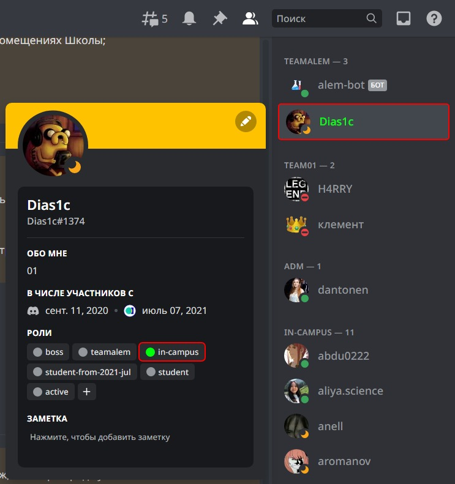

# О считывании часов студента
На данный момент студент должен набирать минимум **20 часов** в неделю в школе `alem`.

## 🔖 Быстрый переход
- [⌚ Как узнать сколько часов набрано в алеме](#как-узнать-сколько-часов-набрано-в-алеме)
- [💡 Как работает программа считывания часов](#как-работает-программа-считывания-часов)
- [⏲️ Как понять что твои часы считываются](#как-понять-что-твои-часы-считываются)
- [⏳ Как начать считывать часы?](#как-начать-считывать-часы)
  - [⚠ Eсли программа не считывает часы](#eсли-программа-не-считывает-часы)
- [❓ Частые вопросы](#частые-вопросы)

## ⌚Как узнать сколько часов набрано в алеме
Временно добавлена возможность узнавать набранные часы за текущую неделю через дискорд бота. И вот как это узнать (начиная с 00:00 последнего Пн до следующего Пн):
1. Зайти на дискорд сервер алема.
2. Найти [алемовского бота](https://discord.com/channels/@me/998550497151692852).
3. Отправить команду `!myhours` в личку бота.

После чего бот ответит примерно так:
```go
Starting calculations
20.7 hours are counted starting from 2023-01-23 (Monday)
```

## 💡Как работает программа считывания часов
Время студента считывается только в учебных компьютерах alem.
Программа начнет считывать часы с того момента как найдет активную сессию студента на платформе `01.alem.school` через один из браузеров:
1. [`Firefox`](https://www.mozilla.org/en-US/firefox/)
2. [`Chrome`](https://www.google.kz/intl/en/chrome/)
> Тут и написан порядок браузеров по которому программа проверяет на наличие сессии студента.

Программа проверяет на наличие сессии, каждые 2 минуты. Если компьютер заблокирован, то через некоторое кол-во времени программа перестает считывать часы.
> Если после длительной блокировки вы сели за компьютер и пользовались им меньше 2х минут, то ваши 2 минуты могли не посчитаться и возможно программа может думать что компьютер не выходил из состояния блокировки. По этому советую после длительной блокировки пользоваться компьютером не менее 3х минут.

## ⏲Как понять что твои часы считываются
На дискорд сервере `alem`-а у вас должна быть присвоена роль `in-campus`. Присваивается оно в течении 10 минут после того как вы начали сессию в `01.alem.school`


## ⏳Как начать считывать часы?
1. Садимся за любой из учебных компьютеров алема.
2. Через один из браузеров (желательно `firefox`) перейдите в платформу [01.alem.school](https://01.alem.school) и залогиньтесь.
3. Проверьте, считываются ли часы одним из способов:
- **1-ый способ:**
3. 1. Запустить текущую команду в терминале.
```sh
tail -f /var/log/syslog | grep --color=always -E "alem-student-logger.+"
```
3. 2. В течении 3х минут в терминале должно вывестись примерно подобное:
```console
Dec 11 12:56:50 ALEM-F4-R02-09 alem-student-logger[1437]: 2022/12/11 12:56:50.398581 start task for browser firefox
Dec 11 12:56:51 ALEM-F4-R02-09 alem-student-logger[1437]: 2022/12/11 12:56:51.085895 finish task for browser firefox
```

- **2-ой способ:**
3. 1. Подождать 10 минут пока на дискорд сервере у вас не появится роль `in-campus`.




### ⚠Eсли программа не считывает часы
Перезагрузите компьютер и выполните все по инструкции выше `Как начать считывать часы?`. Если даже это не поможет, попросите помощи `teamalem`.

## ❓Частые вопросы

<details>
<summary>

### ↕️ Считается ли время у заблокированного компьютера?
</summary>

Да, но только некоторое время с момента блокировки компьютера.

</details>
<details>
<summary>

### ↕️ Как узнать сколько времени у меня посчиталось за сегодня на текущем компьютере?
</summary>

Это можно узнать по логам программы, за несколько шагов.
1. Запустить текущую команду в терминале.
```sh
cat /var/log/syslog | grep --color=always -E "alem-student-logger.+" | grep "finish" | cat -n
```
2. Посчитайте количество записей на период использования вашего компьютера вами.
3. Полученное количество умножьте на 2, и тогда вы получите количество минут засчитанное за компьютером.

</details>
