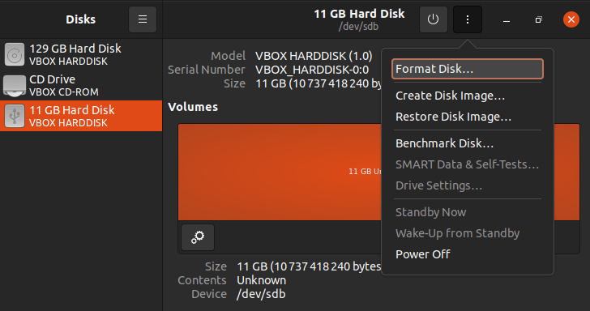
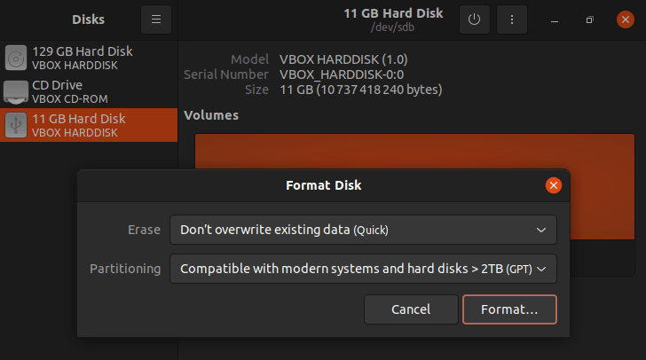
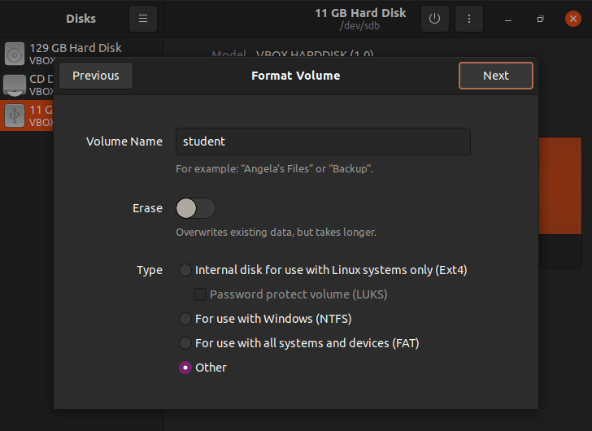
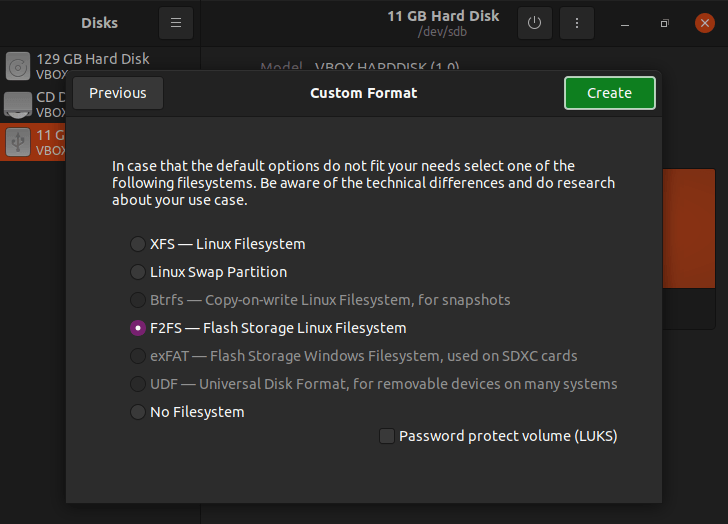
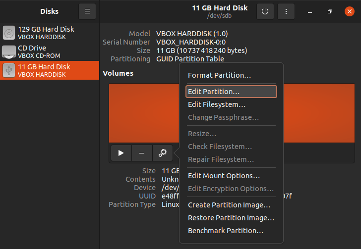
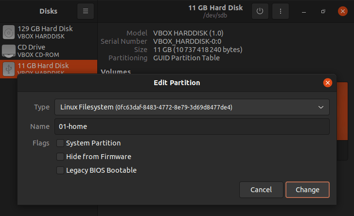

# USB CONFIGURATION

Requirements:

1. 32 GB
2. USB 3.x

Follow the steps:

1. Execute the "Disks" program
2. Choose the USB drive to configure and "Format Disk"

3. Choose "Compatible with modern systems and hard disks > 2TB(GPT)"

4. Create a new partition using all the free space

- Volume name: `any`
- Erase: `no`
- Type: `other`

5. Choose F2FS

6. "Edit Partition"

7. The new name must be "01-home"

